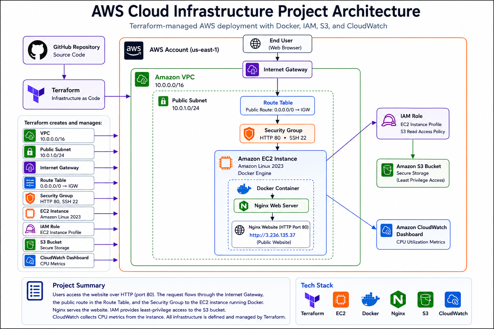
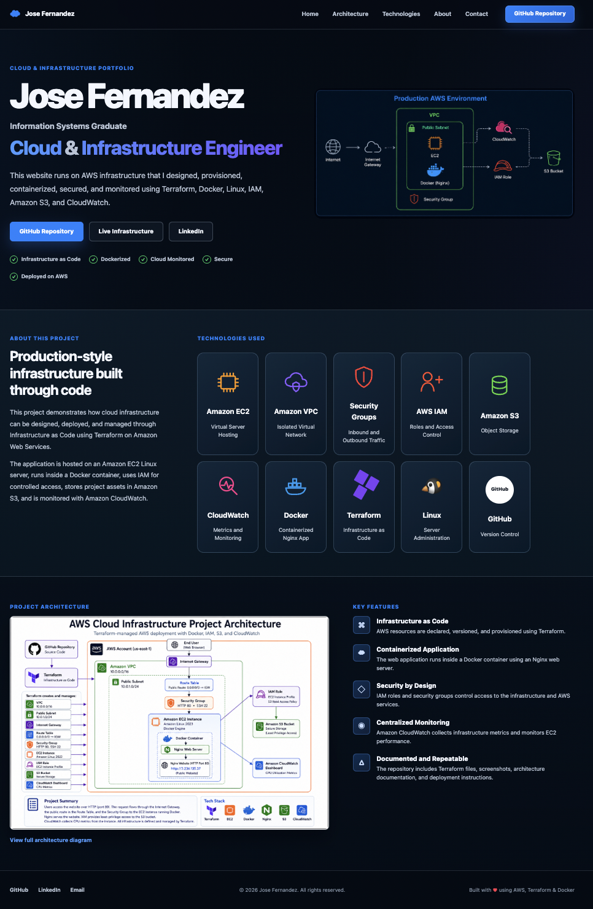

# AWS Cloud Infrastructure Project

Production-style cloud infrastructure deployed on Amazon Web Services using **Terraform**, **Docker**, **Amazon EC2**, **Linux**, **IAM**, **S3**, and **CloudWatch**.

Built as a production-style cloud infrastructure portfolio project to demonstrate Infrastructure as Code, AWS networking, containerization, monitoring, and cloud security best practices.

> ## ⚠️ Important
>
> This project is hosted on an AWS EC2 instance that is normally **stopped** to minimize AWS costs.
>
> The repository contains the complete Infrastructure as Code (Terraform), application source code, architecture diagrams, deployment screenshots, and documentation.
>
> The live environment can be started on demand within a few minutes if a demonstration is requested.

---

# Architecture Diagram



---

# Live Environment

## Current Status

The application is deployed on an Amazon EC2 instance and is available whenever the instance is started.

Since the EC2 instance uses a **dynamic public IP address**, the live URL changes whenever the instance is stopped and started.

The deployment screenshots below show the application running successfully in AWS.

### Deployment Status

✅ Hosted on Amazon EC2

✅ Infrastructure Provisioned with Terraform

✅ Containerized with Docker

✅ Linux Web Server

✅ Monitored with Amazon CloudWatch

---

# Project Overview

This project demonstrates how modern cloud infrastructure can be deployed and managed entirely through **Infrastructure as Code (IaC)** using Terraform on Amazon Web Services.

The deployment provisions networking, compute, security, monitoring, storage, and application hosting automatically without requiring manual configuration through the AWS Console.

The project showcases technologies and practices commonly used by Cloud Engineers, DevOps Engineers, Cloud Administrators, and Systems Engineers.

---

# Infrastructure Components

| Component | Purpose |
|-----------|---------|
| Terraform | Defines and provisions AWS infrastructure as code |
| Amazon VPC | Creates an isolated virtual network |
| Public Subnet | Hosts the EC2 instance with internet access |
| Internet Gateway | Enables public internet connectivity |
| Route Table | Routes outbound internet traffic |
| Security Group | Controls inbound HTTP and SSH access |
| Amazon EC2 | Hosts the Linux server |
| Docker | Containerizes the web application |
| Linux Web Server | Serves the application |
| IAM Role | Provides secure AWS permissions |
| Amazon S3 | Stores project assets |
| Amazon CloudWatch | Monitors EC2 performance and metrics |

---

# Deployment Screenshots

## Live Website



---

## Amazon EC2 Instance


---

## Amazon CloudWatch Dashboard


---

# Skills Demonstrated

- Amazon Web Services (AWS)
- Infrastructure as Code (Terraform)
- Amazon EC2
- Amazon VPC
- Public Subnet Configuration
- Internet Gateway Configuration
- Route Tables
- Security Groups
- Docker Containerization
- Linux Server Administration
- IAM Roles and Permissions
- Amazon S3
- Amazon CloudWatch Monitoring
- Git Version Control
- GitHub Repository Management
- Technical Documentation

---

# Project Structure

```text
aws-cloud-infrastructure-project/
│
├── docs/
│   ├── architecture-diagram.png
│   ├── live-website.png
│   ├── ec2-instance.png
│   └── cloudwatch-dashboard.png
│
├── terraform/
│   ├── Dockerfile
│   ├── iam.tf
│   ├── index.html
│   ├── main.tf
│   ├── monitoring.tf
│   ├── outputs.tf
│   ├── provider.tf
│   ├── style.css
│   ├── terraform.tfvars
│   ├── variables.tf
│   └── versions.tf
│
├── .gitignore
└── README.md
```

---

# Deployment Process

1. Configure the AWS provider
2. Initialize Terraform
3. Review the execution plan
4. Deploy the AWS infrastructure
5. Build the Docker image
6. Run the container on the EC2 instance
7. Verify the application through the public IP
8. Monitor the infrastructure using Amazon CloudWatch

---

# Terraform Commands

```bash
terraform init

terraform plan

terraform apply

terraform destroy
```

---

# Technologies Used

- Amazon Web Services (AWS)
- Terraform
- Docker
- Amazon EC2
- Amazon VPC
- IAM
- Amazon S3
- Amazon CloudWatch
- Linux
- HTML
- CSS
- Git
- GitHub

---

# Key Takeaways

This project demonstrates the ability to:

- Build cloud infrastructure using Infrastructure as Code
- Deploy production-style AWS networking
- Configure secure access with Security Groups and IAM
- Deploy applications inside Docker containers
- Host applications on Amazon EC2 Linux servers
- Monitor infrastructure using CloudWatch
- Document and version cloud projects using Git and GitHub

---

## Author

**Jose Fernandez**

Information Systems Graduate | Cloud • Infrastructure • AWS

Built as a portfolio project demonstrating AWS cloud infrastructure deployment using Infrastructure as Code.
